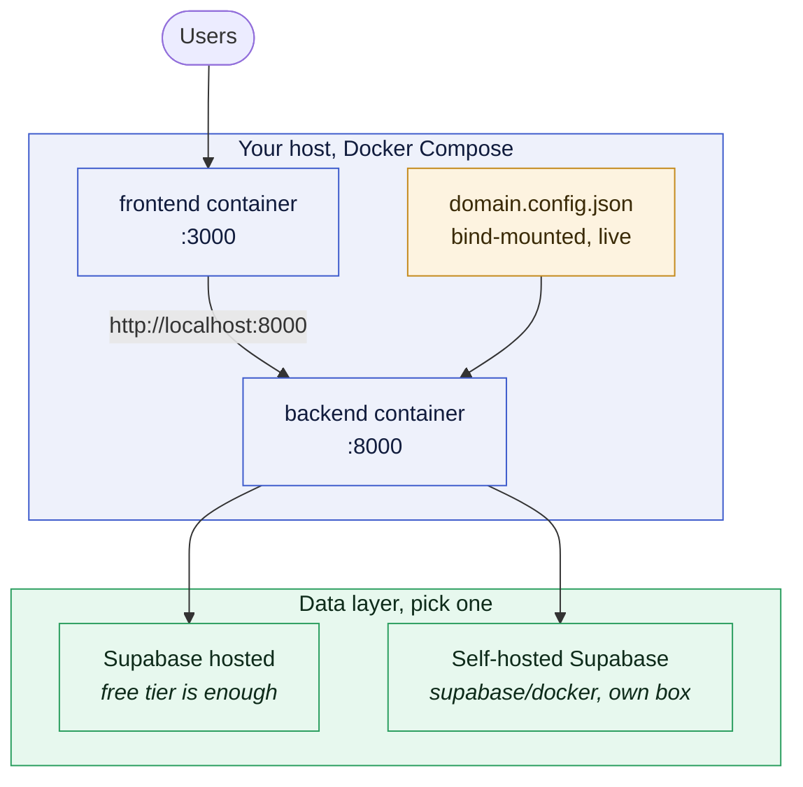

# Deployment

Three ways to run this, covered in order below.

| | What it is | Where |
|---|---|---|
| **Managed** | Vercel + Railway + Supabase, the full app | [sections 0-3](#0-prerequisites--a-production-supabase-project) |
| **Showcase-only** | the landing page alone, no backend at all | [Showcase-only](#showcase-only-the-landing-page-on-its-own) |
| **Self-hosted** | both containers on your own host or VPS | [Self-hosting](#self-hosting) |

The managed split:

| Layer | Platform | Source |
|-------|----------|--------|
| Frontend (Next.js) | **Vercel** | `frontend/` |
| Backend (FastAPI) | **Railway** | `backend/` (Dockerfile) |
| Postgres + Auth | **Supabase** | hosted project |

`main` is the production branch. Merge a PR into `main` → both platforms
redeploy automatically.

---

## 0. Prerequisites, a production Supabase project

Use a **separate** Supabase project for production (don't share your dev one,
seeding/reset are destructive). From **Settings → API** and **Connect** collect:

- Project URL (`SUPABASE_URL`)
- `anon` public key (`SUPABASE_ANON_KEY`)
- `service_role` key (`SUPABASE_SERVICE_KEY`)
- Session-pooler connection string (`SUPABASE_DB_URL`)

The backend applies `supabase/schema.sql` on first boot, so the project can
start empty (seed it afterwards with `make reseed`), **but only if `SUPABASE_DB_URL` is set** (see below).
Table creation runs DDL over a direct Postgres connection, which is impossible
through the REST key alone; without `SUPABASE_DB_URL` the app boots with no
tables. Startup logs `Schema applied from …` on success, or a loud
`SUPABASE_DB_URL not set` / `Schema setup FAILED` warning otherwise.

---

## 1. Backend → Railway

1. **New Project → Deploy from GitHub repo**, pick this repo.
2. Open the service → **Settings → Source** → leave **Root Directory** as the
   **repo root** (empty / `/`), **not** `backend`. The backend reads two
   repo-root files (`domain.config.json`, `supabase/schema.sql`) that only exist
   in the image when the build context is the whole repo. Railway reads
   `railway.json` at the root, which points the build at `backend/Dockerfile`.
   There is deliberately only **one** `railway.json`, at the repo root. Setting
   Root Directory to `backend` does not just read a different config, it breaks
   the build outright, because `backend/Dockerfile` copies `backend/…`,
   `supabase/` and `domain.config.json`, none of which exist inside `backend/`.
3. **Settings → Networking → Generate Domain** to get a public URL
   (e.g. `https://codaro-backend.up.railway.app`).
4. **Variables**: add:
   ```
   SUPABASE_URL=...
   SUPABASE_SERVICE_KEY=...
   SUPABASE_ANON_KEY=...
   SUPABASE_DB_URL=...
   CORS_ORIGINS=https://<your-vercel-domain>.vercel.app
   WEB_CONCURRENCY=1
   ```
   Do **not** set `PORT`, Railway injects it and the container binds `$PORT`.
5. **Region:** set the service region to match your Supabase project's region
   (Settings → Region) so every backend→DB query stays same-region. This is the
   single biggest latency win and costs nothing.
6. Deploy. Health check hits `/health`; the deploy goes live only once it passes.

> You'll set `CORS_ORIGINS` again after step 2 once you know the real Vercel URL.

## 2. Frontend → Vercel

1. **Add New → Project**, import this repo.
2. Set **Root Directory = `frontend`** (Vercel auto-detects Next.js).
3. **Environment Variables:**
   ```
   NEXT_PUBLIC_API_BASE=https://<your-railway-backend-domain>
   NEXT_PUBLIC_SUPABASE_URL=https://<your-project>.supabase.co
   NEXT_PUBLIC_SUPABASE_ANON_KEY=<anon public key>
   ```
4. Deploy. Note the production URL (`https://<app>.vercel.app`).

## 3. Close the loop

- Put the Vercel URL into Railway's `CORS_ORIGINS` and redeploy the backend.
- In **Supabase → Authentication → URL Configuration**, add the Vercel URL to
  **Site URL / Redirect URLs** so email/password auth redirects resolve.

---

## Showcase-only: the landing page on its own

Arbor's hosted demo is retired. If you want the project *visitable* without
paying for a backend, deploy the frontend alone in showcase-only mode: the
landing page is presentational and renders with no API behind it.

On Vercel, set one variable and redeploy:

```
NEXT_PUBLIC_SHOWCASE_ONLY=1
```

`NEXT_PUBLIC_API_BASE` is then unused and can be dropped. No backend, no
Supabase, no `CORS_ORIGINS`.

Set the site URL too, so the social card resolves against a stable hostname:

```
NEXT_PUBLIC_SITE_URL=https://your-domain.vercel.app
```

Without it the Open Graph tags fall back to `VERCEL_URL`, which is the
*per-deployment* hostname. The card still works, but its image URL changes with
every deploy, and previously scraped cards point at an old one.

What the flag changes ([`src/config/showcase.ts`](frontend/src/config/showcase.ts)):

| | Normal | Showcase-only |
|---|---|---|
| Served routes | all of them | `/` and `/privacy` |
| Sign-in CTAs | `/login` | the source repository |
| everything else | served | redirects to `/` |

The redirect is the point. Left reachable, the app routes load and then fail
every request, which reads as a broken app rather than a deliberately static
one.

Unset the flag and everything behaves normally; this is a deployment mode, not a
fork.


## Self-hosting

The managed path above is one option. Both app layers also ship as containers,
so the whole thing runs on your own hardware.

### The shape of it



Both app layers ship as containers and start with one command. The only piece you
cannot avoid is a Supabase-compatible data layer: the engine uses Supabase both
for Postgres and for Auth (JWT issuance plus JWKS verification), so it expects a
Supabase project, hosted or self-hosted.


### What you control

| Piece | Self-hostable | How |
|---|---|---|
| Frontend (Next.js) | Yes | `frontend/Dockerfile`, any Node 20 host |
| Backend (FastAPI) | Yes | `backend/Dockerfile`, any Docker host |
| Postgres | Yes | Supabase self-hosted (`supabase/docker`) or any Postgres reachable via `SUPABASE_DB_URL` |
| Auth | Supabase-flavoured | Supabase Auth (GoTrue), hosted or self-hosted. See the caveat below. |
| Config and vocabulary | Yes | `domain.config.json`, bind-mounted and live-editable |

> **Auth caveat.** The backend verifies access tokens against the project's JWKS
> endpoint (`/auth/v1/.well-known/jwks.json`) using ES256 or RS256. Symmetric
> HS256 is deliberately rejected, because letting the token header pick the
> algorithm lets an attacker pick the weaker one. If you self-host Supabase, run
> a version new enough to sign with asymmetric JWT keys and expose a JWKS
> endpoint. Otherwise logins verify against nothing and protected endpoints will
> refuse the token.

### 1. Self-host the app, use a hosted Supabase project

The shortest path, and the one every command in this repo assumes.

```bash
git clone git@github.com:kaveOO/Arbor.git && cd Arbor
cp backend/.env.example backend/.env
cp frontend/.env.local.example frontend/.env.local
make start
```

Frontend on **:3000**, backend on **:8000**. On first boot the backend applies
[`supabase/schema.sql`](supabase/schema.sql) over `SUPABASE_DB_URL`. It is
idempotent, so restarts are safe. Seeding is a separate, explicit step: run
`make reseed` once to fill an empty database with demo data.

### 2. Self-host everything, including Supabase

Run the [Supabase self-hosted Docker stack](https://supabase.com/docs/guides/self-hosting/docker)
on your box, then point this app at it. The variable names do not change, only
the values:

```bash
# backend/.env
SUPABASE_URL=http://supabase-kong:8000
SUPABASE_SERVICE_KEY=<your service_role key>
SUPABASE_ANON_KEY=<your anon key>
SUPABASE_DB_URL=postgresql://postgres:<pw>@supabase-db:5432/postgres
CORS_ORIGINS=https://booking.example.com
WEB_CONCURRENCY=1
```

```bash
# frontend/.env.local
NEXT_PUBLIC_API_BASE=https://api.example.com
NEXT_PUBLIC_SUPABASE_URL=https://supabase.example.com
NEXT_PUBLIC_SUPABASE_ANON_KEY=<your anon key>
```

If both stacks run on the same host, put them on a shared Docker network so the
backend can reach Kong and Postgres by container name.

### 3. Self-host on a VPS behind your own reverse proxy

Terminate TLS at nginx, Caddy or Traefik and route by hostname:

| Hostname | Routes to | Health probe |
|---|---|---|
| `booking.example.com` | `frontend:3000` | `/` |
| `api.example.com` | `backend:8000` | `GET /health` |

Then set `CORS_ORIGINS=https://booking.example.com` on the backend and
`NEXT_PUBLIC_API_BASE=https://api.example.com` on the frontend, and add the
frontend URL to **Supabase, Authentication, URL Configuration** so auth
redirects resolve.

> **Production note on the frontend image.** The shipped
> [`frontend/Dockerfile`](frontend/Dockerfile) starts Next.js in dev mode
> (`npm run dev`), which is what `docker compose` uses for hot-reload. For a real
> deployment, build and serve instead (`npm ci && npm run build && npm start`), or
> let Vercel do it. The backend image already defaults to its production command
> (`uvicorn` binding `$PORT`, no `--reload`).

> **Keep `WEB_CONCURRENCY=1`.** Schema setup runs in the FastAPI lifespan, that
> is, once per worker, so more than one worker applies the DDL concurrently on a
> cold start. To scale out, move schema setup into a pre-deploy step first.

### Data safety

The database is remote Supabase, not a Docker volume. `make reset` removes only
the local `node_modules` and `.next` volumes; it never touches your data. The one
destructive command is `make reseed`, which truncates the base tables and rebuilds
demo data from the current config.

## Continuous deployment

Both platforms watch GitHub:

- **PR opened** → Vercel builds a **preview URL**; your existing `.github/
  workflows/ci.yml` runs tests/typecheck/build as the quality gate.
- **Merge to `main`** → Vercel promotes production, Railway redeploys the
  backend. No extra pipeline YAML needed.

(Optional) In Railway, enable **PR environments** if you want a throwaway
backend per PR, off by default because it multiplies usage.

---

## Notes & gotchas

- **`WEB_CONCURRENCY=1` is deliberate.** `create_tables_if_configured()` runs
  in the FastAPI lifespan, i.e. once *per worker*, so more than one worker
  applies the DDL concurrently on a cold start. To scale out, move schema setup
  into a Railway **pre-deploy command** (or a one-off job) and then raise
  `WEB_CONCURRENCY`. (No seeding runs on startup.)
- **Local dev is unchanged.** `docker-compose.yml` overrides the container
  command with `--reload`; the image's default `CMD` is the production command.
- **Build context is the repo root, not `backend/`.** The backend resolves
  `domain.config.json` and `supabase/schema.sql` relative to the repo root
  (`parents[2]` of `backend/app/*.py`), so the Dockerfile copies them in and the
  image must be built from the root. Keep Railway's Root Directory empty.
- **Don't hardcode URLs.** Frontend reads `NEXT_PUBLIC_API_BASE`; backend CORS
  reads `CORS_ORIGINS`. Everything else is Supabase config.
