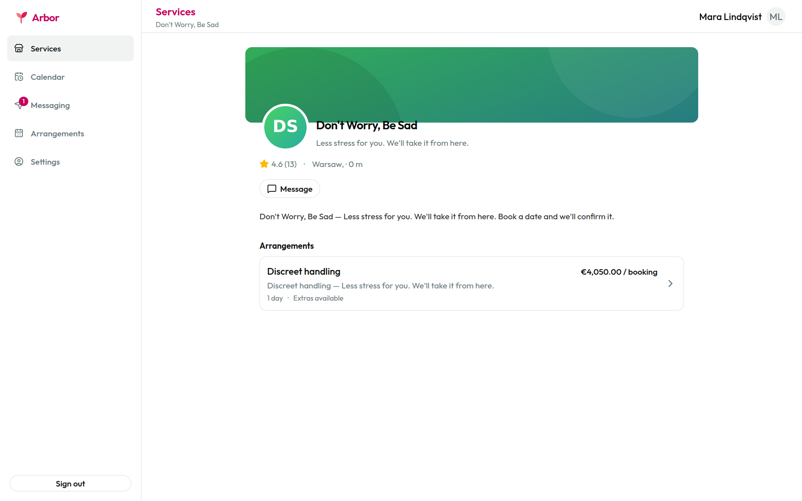
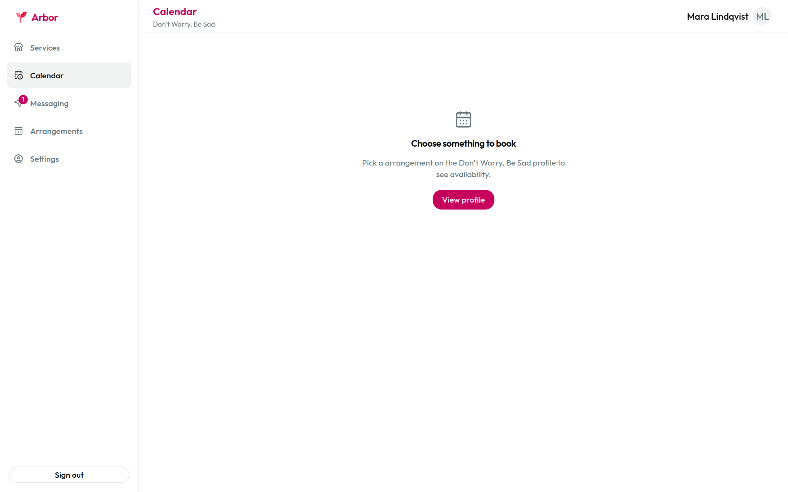
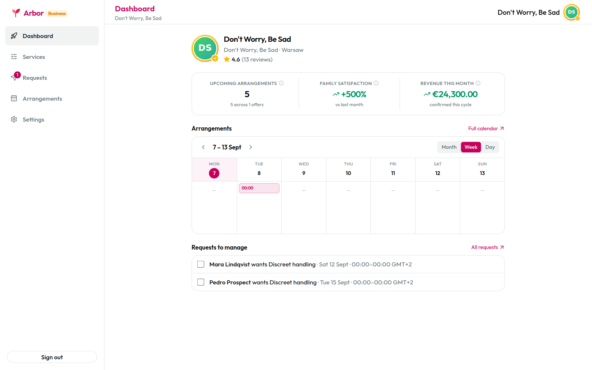
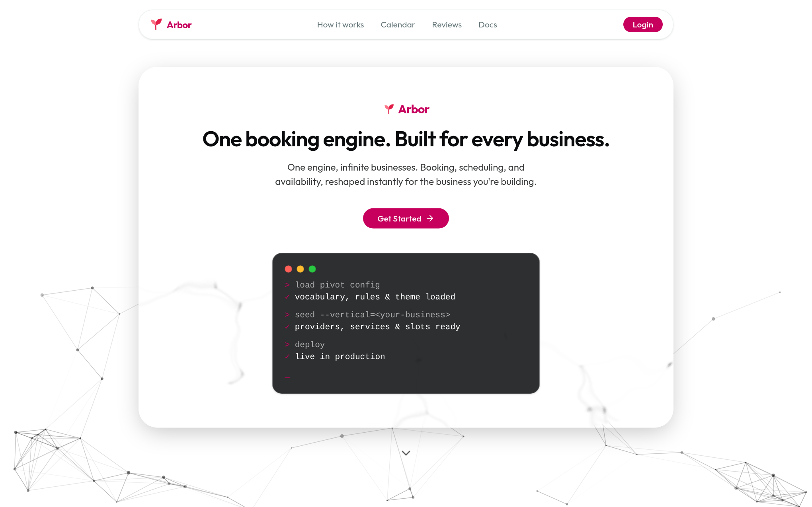
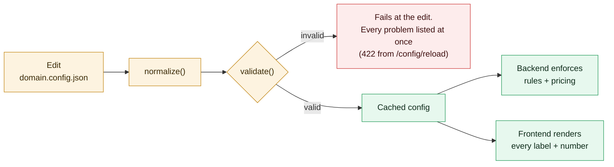
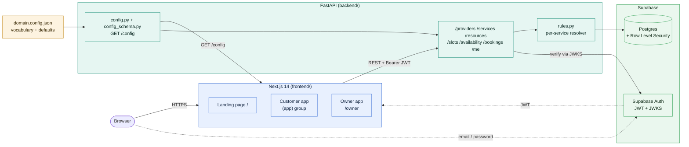
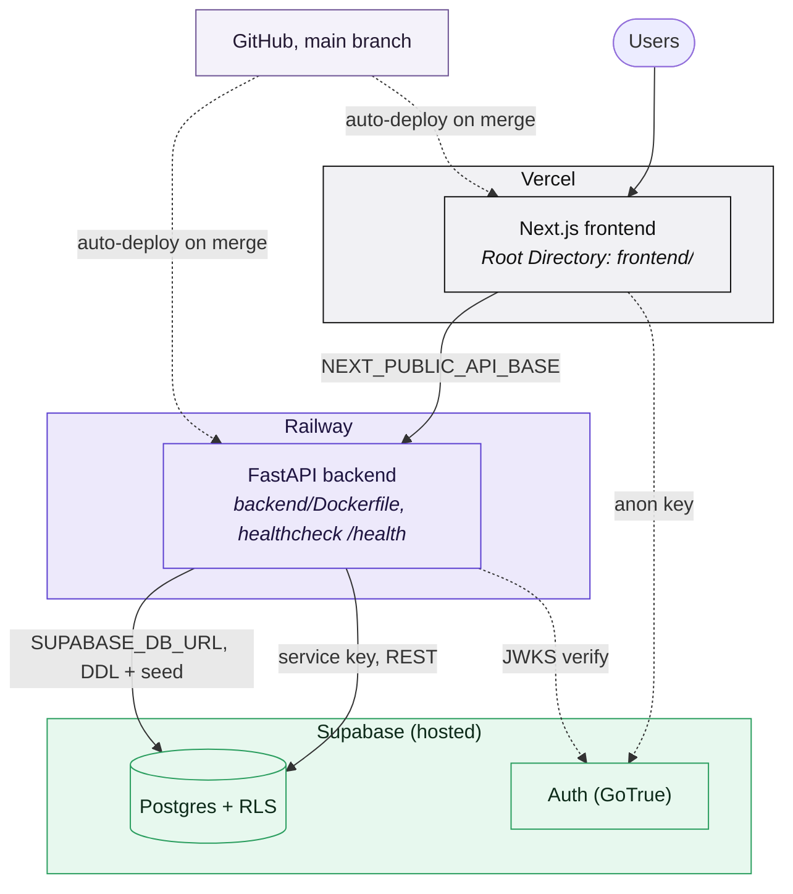
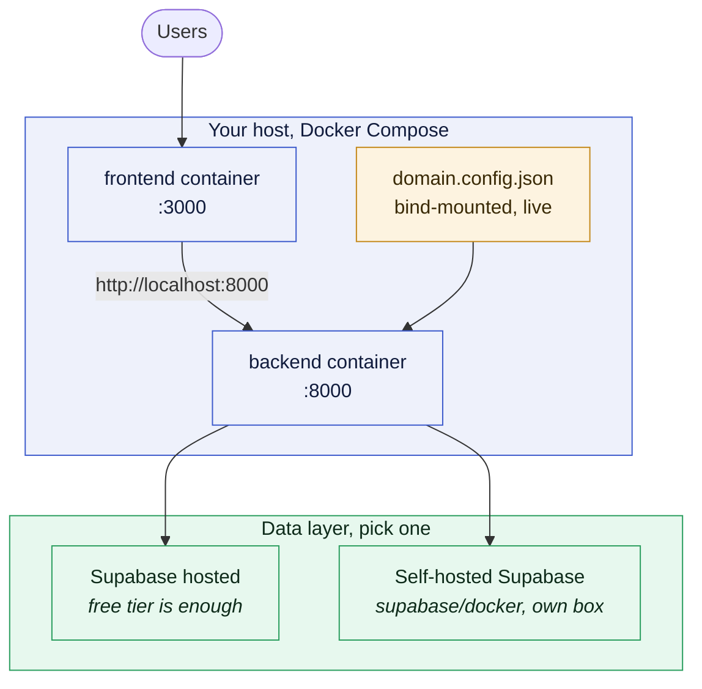

<div align="center">

# Codaro Booking Engine

**A generic, config-driven booking engine. Pivot the whole product by editing one JSON file.**

`provider -> service -> resource -> slot -> booking -> user`

🏆 **First place, Track B (Booking and Resource Scheduling), at the Codaro x Google for Startups hackathon.**

[](#team)
[](https://github.com/kaveOO/Arbor/actions/workflows/ci.yml)
[](frontend/)
[](backend/)
[](supabase/)
[](docker-compose.yml)
[](LICENSE)

[Quick start](#quick-start-local) | [The pivot system](#the-pivot-system) | [Architecture](#architecture) | [Self-hosting](#self-hosting) | [Team](#team) | [Docs](#documentation)

</div>

## What this is

A booking engine built so that a completely different niche can be adopted via
config plus seed data instead of a rewrite. Multi-slot bookings, party size,
reviews, follows, search, day-availability and month-density all ride on one
neutral spine.

The product has three faces:

| Surface | What it does |
|---|---|
| **Public landing page** | Showcases what's on offer, at the site root `/`. |
| **Customer app** | Browse and search, view available slots, book, reschedule, cancel. |
| **Business owner app** | Edit slots, add services, confirm or cancel bookings, view all bookings, per-item analytics. |

Everything the user reads (every noun, CTA, empty state) and every number the
engine enforces comes from [`domain.config.json`](domain.config.json). Nothing in
code hard-codes a term or a magic number.

## Screenshots

Every noun, label and price below is rendered from `domain.config.json`. This
deployment is configured as a funeral home, so the engine's neutral
`provider / service / resource / slot` spine surfaces as Funeral Home,
Arrangement, Chapel and Date. Point it at a different config and the same
screens speak a different business.

| Browse a business | Availability |
|---|---|
|  |  |
| Services, reviews and booking entry points, all labelled from config. | Month density plus per-day slots, the Track B availability view. |

| Owner dashboard | Landing page |
|---|---|
|  |  |
| The business side: requests, calendar, services and per-item analytics. | The public front door at `/`. |


## Quick start (local)

Both env files must exist before `make start`. Each service declares its own
`env_file`, so a fresh clone fails without them.

```bash
cp backend/.env.example backend/.env
cp frontend/.env.local.example frontend/.env.local
make start
```

Prefer no Docker? Run the two halves natively:

```bash
cd backend && python -m venv .venv && source .venv/bin/activate && pip install -r requirements.txt && uvicorn app.main:app --reload
```

```bash
cd frontend && npm install && npm run dev
```

Config, `supabase/`, and both app trees are bind-mounted, so edits are live with
no rebuild. Rebuild only when dependencies change.

## The pivot system

`domain.config.json` (**v2**) holds the engine's vocabulary and the shape of the
offering. Editing it plus `make reload` re-skins and re-rules the entire app.



| Block | Controls |
|---|---|
| `terms`, `copy` | Vocabulary, CTAs, empty states |
| `capabilities` | On/off spine: payments, inventory, waitlist, quotes, reviews |
| `booking` | Unit kind, granularity, duration mode, party rules, add-ons |
| `pricing` | Rate, tiers, fees, caps, deposit (per-hour, per-night, per-person) |
| `payments` | Flow, payer, schedule, billing cycle, no-show fee |
| `inventory` | none, finite, rentable, consumable, serialised |
| `location` | On-site, at-customer, remote, delivery, pickup, timezone, service area |
| `prerequisites` | ID checks, intake forms, waivers, memberships, approvals |
| `timing` | Instant vs request-approve, waitlist, seasons, blackouts, lead time |
| `metaFields` | Custom fields per entity, with **no migration** |

Config is the default; the service row is the override. A service's own columns
win over the config globals, and `services.metadata.<block>` lifts that precedence
to whole blocks, which is how one deployment hosts businesses that price and gate
completely differently.

Proof it pivots: 100 deliberately different businesses live in [`pivots/`](pivots/)
as complete, drop-in config files, each run through the real validator and pricing
engine (`python3 scripts/check_pivots.py`).

## Architecture



Three moving parts, one seam each:

- **Frontend** talks to the backend through a single typed client,
  [`frontend/src/api/index.ts`](frontend/src/api/index.ts).
- **Backend** reads the pivot file once, validates it, caches it, and serves it
  at `GET /config`.
- **Database** never changes at pivot time. New domain fields go into each
  table's `metadata jsonb` column, so a pivot needs no migration.

## Where the stack runs

The three layers are deliberately decoupled, so each one can live wherever you
want it. Two topologies are documented and supported.

### Option A: managed platforms (the default deployment)



| Layer | Platform | Source | Notes |
|---|---|---|---|
| Frontend | **Vercel** | `frontend/` | Root Directory = `frontend` |
| Backend | **Railway** | repo root + `backend/Dockerfile` | Root Directory stays **empty**, the image needs repo-root files |
| Postgres + Auth | **Supabase** | hosted project | Schema applied automatically on first boot |

Full walkthrough with every environment variable: **[DEPLOY.md](DEPLOY.md)**.

### Option B: self-hosted (your machine, your VPS, your rules)



Both app layers ship as containers and start with one command. The only piece you
cannot avoid is a Supabase-compatible data layer: the engine uses Supabase both
for Postgres and for Auth (JWT issuance plus JWKS verification), so it expects a
Supabase project, hosted or self-hosted.

## Self-hosting

### What you control

| Piece | Self-hostable | How |
|---|---|---|
| Frontend (Next.js) | Yes | `frontend/Dockerfile`, any Node 20 host |
| Backend (FastAPI) | Yes | `backend/Dockerfile`, any Docker host |
| Postgres | Yes | Supabase self-hosted (`supabase/docker`) or any Postgres reachable via `SUPABASE_DB_URL` |
| Auth | Supabase-flavoured | Supabase Auth (GoTrue), hosted or self-hosted. See the caveat below. |
| Config and vocabulary | Yes | `domain.config.json`, bind-mounted and live-editable |

> **Auth caveat.** The backend verifies access tokens against the project's JWKS
> endpoint (`/auth/v1/.well-known/jwks.json`) using ES256 or RS256. Symmetric
> HS256 is deliberately rejected, because letting the token header pick the
> algorithm lets an attacker pick the weaker one. If you self-host Supabase, run
> a version new enough to sign with asymmetric JWT keys and expose a JWKS
> endpoint. Otherwise logins verify against nothing and protected endpoints will
> refuse the token.

### 1. Self-host the app, use a hosted Supabase project

The shortest path, and the one every command in this repo assumes.

```bash
git clone git@github.com:kaveOO/CodaroHackathon.git && cd CodaroHackathon
cp backend/.env.example backend/.env
cp frontend/.env.local.example frontend/.env.local
make start
```

Frontend on **:3000**, backend on **:8000**. On first boot the backend applies
[`supabase/schema.sql`](supabase/schema.sql) over `SUPABASE_DB_URL` and seeds demo
data if the database is empty. Both steps are idempotent, so restarts are safe.

### 2. Self-host everything, including Supabase

Run the [Supabase self-hosted Docker stack](https://supabase.com/docs/guides/self-hosting/docker)
on your box, then point this app at it. The variable names do not change, only
the values:

```bash
# backend/.env
SUPABASE_URL=http://supabase-kong:8000
SUPABASE_SERVICE_KEY=<your service_role key>
SUPABASE_ANON_KEY=<your anon key>
SUPABASE_DB_URL=postgresql://postgres:<pw>@supabase-db:5432/postgres
CORS_ORIGINS=https://booking.example.com
WEB_CONCURRENCY=1
```

```bash
# frontend/.env.local
NEXT_PUBLIC_API_BASE=https://api.example.com
NEXT_PUBLIC_SUPABASE_URL=https://supabase.example.com
NEXT_PUBLIC_SUPABASE_ANON_KEY=<your anon key>
```

If both stacks run on the same host, put them on a shared Docker network so the
backend can reach Kong and Postgres by container name.

### 3. Self-host on a VPS behind your own reverse proxy

Terminate TLS at nginx, Caddy or Traefik and route by hostname:

| Hostname | Routes to | Health probe |
|---|---|---|
| `booking.example.com` | `frontend:3000` | `/` |
| `api.example.com` | `backend:8000` | `GET /health` |

Then set `CORS_ORIGINS=https://booking.example.com` on the backend and
`NEXT_PUBLIC_API_BASE=https://api.example.com` on the frontend, and add the
frontend URL to **Supabase, Authentication, URL Configuration** so auth
redirects resolve.

> **Production note on the frontend image.** The shipped
> [`frontend/Dockerfile`](frontend/Dockerfile) starts Next.js in dev mode
> (`npm run dev`), which is what `docker compose` uses for hot-reload. For a real
> deployment, build and serve instead (`npm ci && npm run build && npm start`), or
> let Vercel do it. The backend image already defaults to its production command
> (`uvicorn` binding `$PORT`, no `--reload`).

> **Keep `WEB_CONCURRENCY=1`.** Schema setup and seeding run in the FastAPI
> lifespan, that is, once per worker, so more than one worker can double-seed on
> a cold start. To scale out, move schema and seed into a pre-deploy step first.

### Data safety

The database is remote Supabase, not a Docker volume. `make reset` removes only
the local `node_modules` and `.next` volumes; it never touches your data. The one
destructive command is `make reseed`, which truncates the base tables and rebuilds
demo data from the current config.

## Repo layout

```
domain.config.json          # THE pivot file (edit only this at pivot time)
supabase/schema.sql         # neutral tables + occupancy view + RLS
backend/                    # FastAPI generic engine
  app/config.py             #   loads the pivot file (+ POST /config/reload)
  app/config_schema.py      #   normalize() + validate() for the whole v2 tree
  app/rules.py              #   per-service resolver + rules engine
  app/routers/              #   /providers /services /resources /slots /bookings
  seed.py                   #   demo data (auto-seeds on first start)
frontend/                   # Next.js 14 + Tailwind
  src/api/index.ts          #   typed backend client (the HTTP seam)
  src/app/page.tsx          #   public landing page
  src/app/(app)/            #   gated customer tabs
  src/app/owner/            #   business mode
pivots/                     # 100 ready-made domain.config.json files
test/                       # stack + API tests
```

## Commands

```bash
make start        # build (if needed) and start frontend :3000 + backend :8000
make reload       # re-read domain.config.json after an edit
make reseed       # wipe + rebuild demo data from the current config
make checkseed    # report where seeded data and the config disagree
make logs         # tail both containers
make stop         # stop containers
make reset        # remove local node_modules/.next volumes, then start fresh
```

Run `make` with no arguments for the full list.

## Documentation

| Doc | What's in it |
|---|---|
| [CLAUDE.md](CLAUDE.md) | The architectural guide. Read this first. |
| [DEPLOY.md](DEPLOY.md) | Vercel, Railway and Supabase, step by step |
| [CONTRIBUTING.md](CONTRIBUTING.md) | Branch naming, PR flow, CI gates |
| [docs/PIVOT-SYSTEM.md](docs/PIVOT-SYSTEM.md) | Every config block and the precedence model |
| [docs/PIVOT-COVERAGE.md](docs/PIVOT-COVERAGE.md) | The 100-pivot evidence run |
| [backend/CLAUDE.md](backend/CLAUDE.md), [frontend/CLAUDE.md](frontend/CLAUDE.md), [supabase/CLAUDE.md](supabase/CLAUDE.md) | Per-layer conventions |
| [REPORT.md](REPORT.md), [TODO.md](TODO.md) | Regenerated snapshots of what works and what's left |

## Team

Built at the Codaro x Google for Startups hackathon, where it took first place
on Track B (Booking and Resource Scheduling).

- [@kaveOO](https://github.com/kaveOO) (Alban Billiette)
- [@Rysia](https://github.com/Rysia)
- [@Delta-43](https://github.com/Delta-43)
- [@piotr-palamiotis](https://github.com/piotr-palamiotis)
- [@philpiano](https://github.com/philpiano)

## License

**[GNU Affero General Public License v3.0](LICENSE)** (AGPL-3.0), an
OSI-approved open source license.

You may use, modify and redistribute this code, including commercially. In
return, the AGPL asks for reciprocity: if you distribute a modified version, or
**run one as a network service that other people use**, you must make the
complete corresponding source of your version available to those users under the
same license. That network clause is what separates the AGPL from the plain GPL,
and it is the reason it fits a hosted booking engine.

Practically, for this repo:

| You want to | AGPL says |
|---|---|
| Self-host it for yourself or your company | Fine, no obligations triggered by internal use |
| Fork it, change it, keep the changes private and unpublished | Fine, as long as you do not distribute or serve it to others |
| Run a modified version as a public SaaS | Allowed, but you must offer your users the modified source |
| Bundle it into a proprietary closed-source product | Not allowed under this license |
