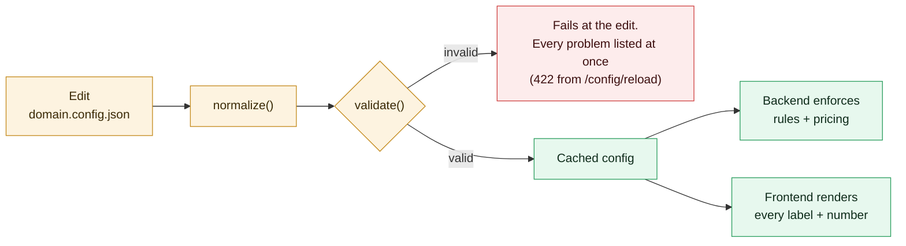

<div align="center">

# Arbor

**A generic, config-driven booking engine. Pivot the whole product by editing one JSON file.**

`provider -> service -> resource -> slot -> booking -> user`

🏆 **First place, Track B (Booking and Resource Scheduling), at the Codaro x Google for Startups hackathon.**

[](#team)
[](https://github.com/kaveOO/Arbor/actions/workflows/ci.yml)
[](frontend/)
[](backend/)
[](supabase/)
[](docker-compose.yml)
[](LICENSE)
[](#project-status)

[What it is](#what-this-is) | [The pivot system](#the-pivot-system) | [Architecture](#architecture) | [Quick start](#quick-start-local) | [Docs](#documentation) | [Team](#team)

</div>

## What this is

A booking engine built so that a completely different niche can be adopted via
config plus seed data instead of a rewrite. Multi-slot bookings, party size,
reviews, follows, search, day-availability and month-density all ride on one
neutral spine.

The product has three faces:

| Surface | What it does |
|---|---|
| **Public landing page** | Showcases what's on offer, at the site root `/`. |
| **Customer app** | Browse and search, view available slots, book, reschedule, cancel. |
| **Business owner app** | Edit slots, add services, confirm or cancel bookings, view all bookings, per-item analytics. |

Everything the user reads (every noun, CTA, empty state) and every number the
engine enforces comes from [`domain.config.json`](domain.config.json). Nothing in
code hard-codes a term or a magic number.

## Screenshots

Every noun, label and price below came from `domain.config.json`, not from the
code. These were captured from one example deployment, so a fresh clone ships a
generic config and reads differently: that difference is the point.

| Browse a business | Availability |
|---|---|
|  |  |
| Services, reviews and booking entry points, all labelled from config. | Month density plus per-day slots, the Track B availability view. |

| Owner dashboard | Landing page |
|---|---|
|  |  |
| The business side: requests, calendar, services and per-item analytics. | The public front door at `/`. |

## The pivot system

`domain.config.json` (**v2**) holds the engine's vocabulary and the shape of the
offering. Editing it plus `make reload` re-skins and re-rules the entire app.



| Block | Controls |
|---|---|
| `terms`, `copy` | Vocabulary, CTAs, empty states |
| `capabilities` | On/off spine: payments, inventory, waitlist, quotes, reviews |
| `booking` | Unit kind, granularity, duration mode, party rules, add-ons |
| `pricing` | Rate, tiers, fees, caps, deposit (per-hour, per-night, per-person) |
| `payments` | Flow, payer, schedule, billing cycle, no-show fee |
| `inventory` | none, finite, rentable, consumable, serialised |
| `location` | On-site, at-customer, remote, delivery, pickup, timezone, service area |
| `prerequisites` | ID checks, intake forms, waivers, memberships, approvals |
| `timing` | Instant vs request-approve, waitlist, seasons, blackouts, lead time |
| `metaFields` | Custom fields per entity, with **no migration** |

Config is the default; the service row is the override. A service's own columns
win over the config globals, and `services.metadata.<block>` lifts that precedence
to whole blocks, which is how one deployment hosts businesses that price and gate
completely differently.

See [docs/PIVOT-SYSTEM.md](docs/PIVOT-SYSTEM.md) for what every block controls
and which keys the engine enforces today.

## Architecture


Three moving parts, one seam each:

- **Frontend** talks to the backend through a single typed client,
  [`frontend/src/api/index.ts`](frontend/src/api/index.ts).
- **Backend** reads the pivot file once, validates it, caches it, and serves it
  at `GET /config`.
- **Database** never changes at pivot time. New domain fields go into each
  table's `metadata jsonb` column, so a pivot needs no migration.

## Quick start (local)

Both env files must exist before `make start`. Each service declares its own
`env_file`, so a fresh clone fails without them.

```bash
cp backend/.env.example backend/.env
cp frontend/.env.local.example frontend/.env.local
make start
```

Prefer no Docker? Run the two halves natively:

```bash
cd backend && python -m venv .venv && source .venv/bin/activate && pip install -r requirements.txt && uvicorn app.main:app --reload
```

```bash
cd frontend && npm install && npm run dev
```

Config, `supabase/`, and both app trees are bind-mounted, so edits are live with
no rebuild. Rebuild only when dependencies change.

**On the demo credentials.** `make reseed` creates demo accounts with fixed
passwords, and the sign-in page lists them (`src/components/demo-logins.tsx`,
`backend/seed.py`). That is deliberate, so anyone can open the app and look
around. They are seed data for a throwaway database and grant nothing anywhere
else, but do not point a real Supabase project at this seeder and then leave it
public.

## Deployment

Three layers, each deployable independently.

| Layer | Managed | Self-hosted |
|---|---|---|
| Frontend (Next.js) | Vercel, root directory `frontend/` | `frontend/Dockerfile`, any Node 20 host |
| Backend (FastAPI) | Railway, `backend/Dockerfile` | any Docker host |
| Postgres + Auth | Supabase hosted | Supabase self-hosted stack |

The landing page also runs **on its own**, with no backend at all
(`NEXT_PUBLIC_SHOWCASE_ONLY=1`). The hackathon backend is retired, so that is
how the landing page can stay live without one.

Every environment variable, both topologies, the VPS and reverse-proxy setup and
the auth caveat: **[DEPLOY.md](DEPLOY.md)**.

## Repo layout

```
domain.config.json          # THE pivot file (edit only this at pivot time)
supabase/schema.sql         # neutral tables + occupancy view + RLS
backend/                    # FastAPI generic engine
  app/config.py             #   loads the pivot file (+ POST /config/reload)
  app/config_schema.py      #   normalize() + validate() for the whole v2 tree
  app/rules.py              #   per-service resolver + rules engine
  app/routers/              #   /providers /services /resources /slots /bookings
  seed.py                   #   demo data (run `make reseed`)
frontend/                   # Next.js 14 + Tailwind
  src/api/index.ts          #   typed backend client (the HTTP seam)
  src/app/page.tsx          #   public landing page
  src/app/(app)/            #   gated customer tabs
  src/app/owner/            #   business mode
test/                       # stack + API tests
```

## Commands

```bash
make start        # build (if needed) and start frontend :3000 + backend :8000
make reload       # re-read domain.config.json after an edit
make reseed       # wipe + rebuild demo data from the current config
make checkseed    # report where seeded data and the config disagree
make logs         # tail both containers
make stop         # stop containers
make reset        # remove local node_modules/.next volumes, then start fresh
```

Run `make` with no arguments for the full list.

## Documentation

| Doc | What's in it |
|---|---|
| [CLAUDE.md](CLAUDE.md) | The architectural guide. Read this first. |
| [DEPLOY.md](DEPLOY.md) | Managed and self-hosted deployment, every variable |
| [docs/PIVOT-SYSTEM.md](docs/PIVOT-SYSTEM.md) | Every config block and the precedence model |
| [backend/CLAUDE.md](backend/CLAUDE.md), [frontend/CLAUDE.md](frontend/CLAUDE.md), [supabase/CLAUDE.md](supabase/CLAUDE.md) | Per-layer conventions |
| [CHANGELOG.md](CHANGELOG.md) | What changed in each release |

**API reference.** The backend generates its own, from the routers, start the
stack and open <http://localhost:8000/docs> (Swagger UI), <http://localhost:8000/redoc>,
or fetch the spec at `/openapi.json`. There is no hand-written endpoint list to
fall out of date.

## Project status

**Finished showcase project. Not actively maintained.**

Built for a hackathon and kept public as a working reference rather than a
maintained product. There is no issue tracker and no contribution process, and
pull requests opened here will not be reviewed.

To change anything, fork it. The AGPL-3.0 licence gives you that right and the
fork is yours to take wherever you want. That applies to security problems too:
the fix will come from your fork, not from here.

## Team

Built at the Codaro x Google for Startups hackathon, where it took first place
on Track B (Booking and Resource Scheduling).

- [@kaveOO](https://github.com/kaveOO) (Alban Billiette)
- [@Rysia](https://github.com/Rysia)
- [@Delta-43](https://github.com/Delta-43)
- [@piotr-palamiotis](https://github.com/piotr-palamiotis)
- [@philpiano](https://github.com/philpiano)

## License

Copyright (C) 2026 Alban Billiette and the Arbor contributors.

**[GNU Affero General Public License v3.0](LICENSE)** (AGPL-3.0). See
[NOTICE](NOTICE) for the copyright and warranty statement.

You may use, modify and redistribute this code, including commercially. In
return, the AGPL asks for reciprocity: if you distribute a modified version, or
**run one as a network service that other people use**, you must make the
complete corresponding source of your version available to those users under the
same license. That network clause is what separates the AGPL from the plain GPL,
and it is the reason it fits a hosted booking engine.

Practically, for this repo:

| You want to | AGPL says |
|---|---|
| Self-host it for yourself or your company | Fine, no obligations triggered by internal use |
| Fork it, change it, keep the changes private and unpublished | Fine, as long as you do not distribute or serve it to others |
| Run a modified version as a public SaaS | Allowed, but you must offer your users the modified source |
| Bundle it into a proprietary closed-source product | Not allowed under this license |
